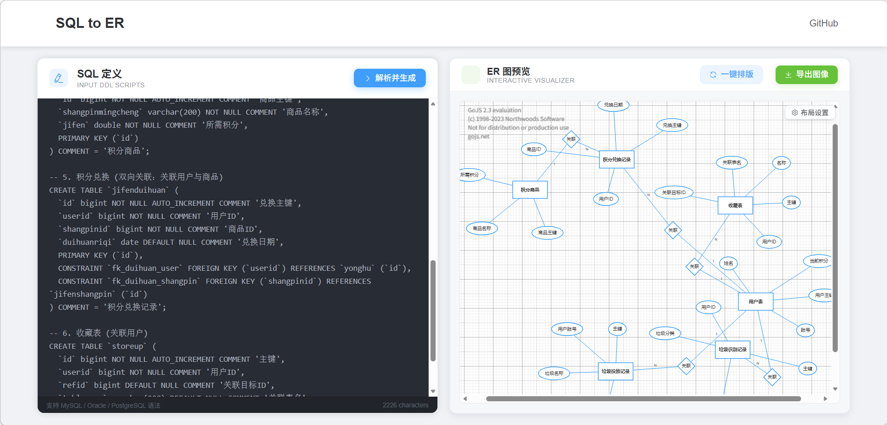

# SQL to ER Diagram Converter

一个优雅的SQL建表语句转ER图的Web应用，支持在线编辑和导出。通过简单的界面操作，轻松将SQL建表语句转换为清晰的实体关系图(ER图)。

[English](./README_EN.md) | 简体中文

## ✨ 在线体验

[在线演示地址](#) // 暂未上线

演示截图

## 🎯 核心功能

### SQL解析能力
- ✅ 支持标准SQL建表语句的解析
- ✅ 自动识别表名、字段名、字段类型
- ✅ 智能识别主键、外键关系
- ✅ 支持批量SQL语句导入
- ✅ 支持表注释和字段注释的解析

### ER图可视化
- ✅ 自动布局的ER图展示
- ✅ 实体表之间关系的可视化
- ✅ 支持拖拽调整图形位置
- ✅ 支持缩放和平移操作
- ✅ 支持多选和框选操作

### 交互编辑
- ✅ 支持拖拽调整实体位置
- ✅ 支持编辑文字

### 导出功能
- ✅ 支持PNG、JPEG格式导出
- ✅ 支持透明背景导出
- ✅ 自动添加时间戳文件名
- ✅ 高清图片质量

## 🚀 技术栈

### 前端 (sql-front)
- 框架：Vue 3 
- 状态管理：Vue Composition API
- UI组件：Element Plus
- 图形渲染：GoJS
- 代码规范：ESLint + Prettier

### 后端 (sql-back)
- 核心框架：Spring Boot 3.x
- 构建工具：Maven
- SQL解析：Druid SQL Parser
- 开发语言：Java 17


## 📦 安装和使用

### 环境要求
- Node.js 16+
- Java 17+
- Maven 3.6+

### 快速开始

1. 克隆项目
```bash
git clone [https://github.com/yourusername/sql-to-er.git](https://github.com/lbytsl/sql_to_ER.git)
```

2. 前端启动
```bash
cd sql-font
npm install
npm run dev
```

3. 后端启动
```bash
cd sql-back
mvn spring-boot:run
```


## 📝 开源协议

本项目采用 [MIT](LICENSE) 开源协议。

## 👨‍💻 作者

作者：[codeMaster]
邮箱：[1012858748@qq.com]

## 🙏 致谢

感谢以下开源项目：

- [Vue.js](https://vuejs.org/)
- [Element Plus](https://element-plus.org/)
- [GoJS](https://gojs.net/)
- [Spring Boot](https://spring.io/projects/spring-boot)

## 📜 版权声明

Copyright © 2025 [codeMaster]

本项目是一个开源项目，遵循 MIT 许可证。您可以自由地使用、修改和分发本项目，但需要保留原作者的版权声明和许可证声明。


## 项目结构
```
.
├── sql-back/          # 后端项目目录
│   ├── src/          # 源代码
│   └── pom.xml       # Maven配置文件
│
├── sql-font/         # 前端项目目录
│   ├── src/         # 源代码
│   └── package.json # npm配置文件
│
└── README.md        # 项目说明文档
```

## 实例
-- 1. 用户基础表
CREATE TABLE `yonghu` (
  `id` bigint NOT NULL AUTO_INCREMENT COMMENT '用户主键',
  `zhanghao` varchar(200) NOT NULL COMMENT '账号',
  `xingming` varchar(200) NOT NULL COMMENT '姓名',
  `jifen` double DEFAULT 0 COMMENT '当前积分',
  PRIMARY KEY (`id`),
  UNIQUE INDEX `idx_zhanghao` (`zhanghao`)
) COMMENT = '用户表';

-- 2. 垃圾识别记录 (关联用户)
CREATE TABLE `lajishibie` (
  `id` bigint NOT NULL AUTO_INCREMENT COMMENT '主键',
  `lajimingcheng` varchar(200) NOT NULL COMMENT '垃圾名称',
  `lajifenlei` varchar(200) NOT NULL COMMENT '垃圾分类',
  `userid` bigint NOT NULL COMMENT '用户ID',
  PRIMARY KEY (`id`),
  CONSTRAINT `fk_shibie_user` FOREIGN KEY (`userid`) REFERENCES `yonghu` (`id`)
) COMMENT = '垃圾识别记录';

-- 3. 垃圾投放记录 (关联用户账号)
CREATE TABLE `lajitoufang` (
  `id` bigint NOT NULL AUTO_INCREMENT COMMENT '主键',
  `zhandianmingcheng` varchar(200) DEFAULT NULL COMMENT '站点名称',
  `lajimingcheng` varchar(200) NOT NULL COMMENT '垃圾名称',
  `zhanghao` varchar(200) DEFAULT NULL COMMENT '用户账号',
  PRIMARY KEY (`id`),
  CONSTRAINT `fk_toufang_user` FOREIGN KEY (`zhanghao`) REFERENCES `yonghu` (`zhanghao`)
) COMMENT = '垃圾投放记录';

-- 4. 积分商品表
CREATE TABLE `jifenshangpin` (
  `id` bigint NOT NULL AUTO_INCREMENT COMMENT '商品主键',
  `shangpinmingcheng` varchar(200) NOT NULL COMMENT '商品名称',
  `jifen` double NOT NULL COMMENT '所需积分',
  PRIMARY KEY (`id`)
) COMMENT = '积分商品';

-- 5. 积分兑换 (双向关联：关联用户与商品)
CREATE TABLE `jifenduihuan` (
  `id` bigint NOT NULL AUTO_INCREMENT COMMENT '兑换主键',
  `userid` bigint NOT NULL COMMENT '用户ID',
  `shangpinid` bigint NOT NULL COMMENT '商品ID',
  `duihuanriqi` date DEFAULT NULL COMMENT '兑换日期',
  PRIMARY KEY (`id`),
  CONSTRAINT `fk_duihuan_user` FOREIGN KEY (`userid`) REFERENCES `yonghu` (`id`),
  CONSTRAINT `fk_duihuan_shangpin` FOREIGN KEY (`shangpinid`) REFERENCES `jifenshangpin` (`id`)
) COMMENT = '积分兑换记录';

-- 6. 收藏表 (关联用户)
CREATE TABLE `storeup` (
  `id` bigint NOT NULL AUTO_INCREMENT COMMENT '主键',
  `userid` bigint NOT NULL COMMENT '用户ID',
  `refid` bigint DEFAULT NULL COMMENT '关联目标ID',
  `tablename` varchar(200) DEFAULT NULL COMMENT '关联表名',
  `name` varchar(200) NOT NULL COMMENT '名称',
  PRIMARY KEY (`id`),
  CONSTRAINT `fk_storeup_user` FOREIGN KEY (`userid`) REFERENCES `yonghu` (`id`)
) COMMENT = '收藏表';
